# untitled-suite

Built by:

- Nathan Blaga [GitHub](https://github.com/NJBLAGA)
- Raymond Doan [GitHub](https://github.com/raymonddoan)

## Background/Problem

Whether on a professional level or for personal projects, task management is an effective and efficient tool for project management. "Task management is the term used to describe how project managers identify, monitor, and track the progress of work that needs to be completed on any given day" (Santos 2021). Task management is critical for the effective development and handling of any project, big or small.

Moreover with the current global pandemic of Covid-19, millions of people have been working from home remotely, adding more strain to the day to day dealings and processes of most projects. More than ever, project teams and individuals working from afar, highlights the importance of task management and handling project development in a agile and organised manner.

## Importance

Task management allows teams and individuals to approach a project with a proactive mindset rather than that of a reactive mindset. Creating roadmaps, procedures, and time frames are essential components of project management. They allow for more efficient and effective development, testing, reviewing/ and implementation than reacting to events that are within and beyond the scope of the team. "Managing tasks ensures that teams are able to prioritize their workloads and guard against time-wasting. It is absolutely imperative in the social media age" (Santos 2021).

Task management through an application such as Untitled Suite when handled in a efficient and effective manner can produce many benefits to a project's team. These benefits include but are not limited to:

- Defining the least to most important priorities through a projects lifecycle
- Creates snapshots of the current project and allows a high-level view of the project all at once
- Reveals time constraints and the available time frame for each task
- Aids in optimisation of grouping or sorting tasks in order of prioritisation which in turn aids in a more efficient scheduling system
- Allows management and team members to work efficiently, effectively and at their maximised productivity levels within their own workloads and time frames
- An automated process which is flexible, tailored to each project and team
- Easy learning curve and utilisation allows for easy flow of mindsets and working habits

## Purpose

Untitled Suite's original intention is to provide project managers and their teams a one stop shop for optimising task management. Moreover whether for the development of a major multi-billion dollar project or a do it yourself project around the house, Untitled Suite aims to remind the user of the important things in life. Through its smooth interface and user-friendly experience, the application is one for the modern day agenda. From task management, daily chores around the house, to tracking and planning your own health or personal growth, Untitled Suite offers efficient and effective tools to optimise your work, your lifestyle, you.

## Functionality / Features

### User Account/Profile

Untitled Suite allows a user to create a unique account. Accessing this account upon login will allow users the abilities to the following:

- Modify their profile settings and account details
- View, update and delete any of their saved lists within Tasker
- View, update and delete any tasks within a certain list
- View, update and delete the current state of their calender
- View, update and delete upcoming events stored within the calender
- Review a backlog of calender events that have past

This feature allows users to customise their Tasker, calender and overall user experience to better suit their taste and style. This results in a more fluent and comfortable atmosphere in which users can feel more attached and give a personal touch to their workflow.

### Admin Dashboard/System

The admin system allows a user who has administrative privileges to log into Untitled Suite and perform routine tasks such as:

- Delete the account of any user who is in violation of Untitled Suite's terms and conditions
- Delete the account of any user who breaches the Untitled Suite's payment policy
- Review and allow administrative privileges to any user who fulfills the required screening procedures

All of the above tasks can be accessed from the Admin Dashboard, which acts as the central hub for all admin. This feature will not be able to be viewed or accessed by any user who is not classified as an admin.

### Paypal Integration

Upon signing up, Untitled Suite offers users a trial tier of the application. This allows the user to the following benefits:

**Trial Tier:**

- Users can create up to 5 unique lists within the Tasker at any given point
- Users will have the ability to create and store unlimited tasks inside these entires
- Users will have access to their calender

At any point users can purchase the premium tier for AUD $5 per month, this allows users to:

**Premium Tier:**

- Users can create unlimited lists within Tasker at any given point.
- Users will have the ability to create and store unlimited tasks inside these entires
- Users will have access to their calender

### Responsive Navbar

Untitled Suite offer its users a responsive and stylish navbar that allows for a smooth experience while navigating between the various components. Built with a mobile first development mindset, the navbar and overall design of the application is handled gracefully across all platforms and devices.

### Responsive Design / Mobile First Design

Utilising Material-UI Untitled Suite is built with the sole intention to approach any task, easier and clearer then ever before. The design of the application was built for the mobile user on the go, the office desktop and of course for the home tablet. It offers its users a sleek an polished professional look and feel, while offering that personal touch to make the users experience that little bit more enjoyable and smooth. Untitled Suite utilises space and functionality of all its components which delivers a users tasks and events in a presentable and elegant manner.

### Tasker

Tasker allows users to create, update and delete any list or task created by their account. Whether on the trial or premium tier, Untitled Suite allows users to create lists within Tasker alongside setting tasks to each list. While creating a task, users can set a description, priority and reminder date. User will also be able to choose which list within Tasker, the task will be allocated to.

### Integrated Calendar System

The calender allows users to create, update or delete events they hve created. Additionally users can link Tasker lists and there tasks to certain events within the calender. Through its user-friendly interface, users can navigate with ease through past and future events they have set within the calender.

## Target Audience

Untitled Suite's primary goal is to offer its users a efficient and effective way to handle and succeed at task management. Whether working on a home project, personal growth, charity work or on a professional level, Untitled Suite offers a solution for any user. Its elegant and smooth design allow for any user to create an account, sign in and start using Tasker to create lists, track tasks and set events. However the target audience for Untitled Suite's initial lunch will focus on several key groups that will benefit greatly from using the application.

### Business Professionals

Focusing on task management teams, both team leaders and the members themselves can benefit from the implementation of Untitled Suite within their task management procedures, project management and agile development mindset. With stable and efficient features, Untitled Suite can aid professionals in the optimisation of defining, planning and completing tasks in a proficient and effective manner.

### Education Sector

Untitled Suite offers the educational system a tool in which teachers and teachers assistants can better plan the upcoming semester or even year. From weekly, monthly and yearly scheduling, any school system can implement Untitled Suite and benefit from its user-friendly design and smooth functionality. Tasker can benefit the classroom by allowing teachers to formulate well structured plans for the semester and by utilising the calender feature can create a more efficient flow of work by setting reminders and events.

### Small Business Owners

Australian based small Businesses and on a global scale have suffered great losses throughout the Covid-19 pandemic. Whether through government aid or self-determination, many of these business are beginning to rebuild, restructure and reopen. This requires great communication, planning and task management between the owners and their workforce. Untitled Suite can dramatically aid in the rebuilding and reopening process by removing some of the hassles of manually handling the task management process. Utilising Tasker, a business owner can define and set the necessary tasks needed to fulfill their projects and target goals. In turn those tasks can be transferred to the calender feature offering employees a top-down perspective on clear time frames, reminders, events and priorities in which tasks need to be completed, reviewed and implemented.

### Home Use

The Australian public during the Covid-19 pandemic were asked to work, school and live from home for weeks and months on end. During this period many Australians discovered and commenced home projects, hobbies and self growth journeys. Even to this day after and between lock-downs, Australians continue to do so. Untitled Suite can benefit Australians with defining, setting and tracking the individual tasks needed within these projects. Providing a user-friendly interface alongside the applications portability between any device allows any user to track their new garden project, their weight loss journey or even feeding schedules for newborn babies. Untitled Suite aims to not only solve task management on a professional level but its here to remind you at home about the important things in life.

## Tech Stack

## Dataflow Diagram

Untitled Suite can be broken up into three main processes or functions, Users, Tasker and Calendar. Both the Users and Tasker functions contain sub-processes within, which have been shown in the further breakdown. The legend in the top left corner represents what each of the symbols represent:

- External entitys reflect entities outside of the application and are represented in yellow curved rectangles.
- Processes and subprocesses reflect how the data and its flow are manipulated and are represented in blue curved rectangles with a header. These headers reflect the collection of the processes respective to function.
- Data stores or databases reflect where the data is stored and are represented in green curved rectangles with a row header.
- Data flows reflect what data is moved and its path across various processes and data stores. These are represented in arrowed lines with the arrow head indicating the end destination.

At 'Start Here', for `Guests` to access the Untitled Suite, they are required to provide their details to either create an account (`1.0`) or log into their account (`2.0`). This will be checked against the `Users` database before authorising the guest as an administrator (`Admin`) or `User`. 

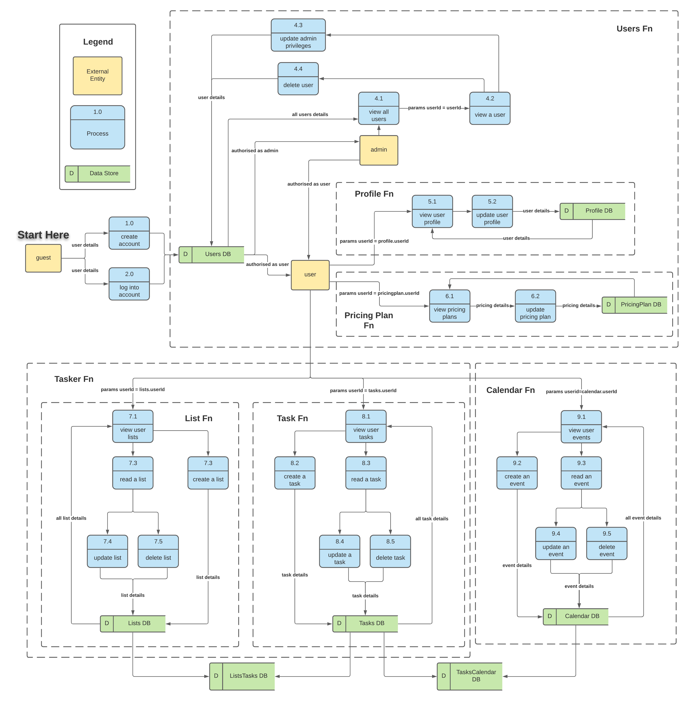

### Users Dataflow

Once logged in, here is where the `User` will interact with their account settings. Within the account settings, `Users` can view and manipulate the data including (see next sections for more details):

- Email and password through `Profile` database
- Subscription plan through `PricingPlan ` database

For `Admins`, they will be able to perform RUD requests to the `Users` database by passing in the updated user details. `Admin` provisions will be set in the `Users` database. `Users` cannot be created through the `Admin` role as only `Users` will be the creator of their own accounts for security purposes.

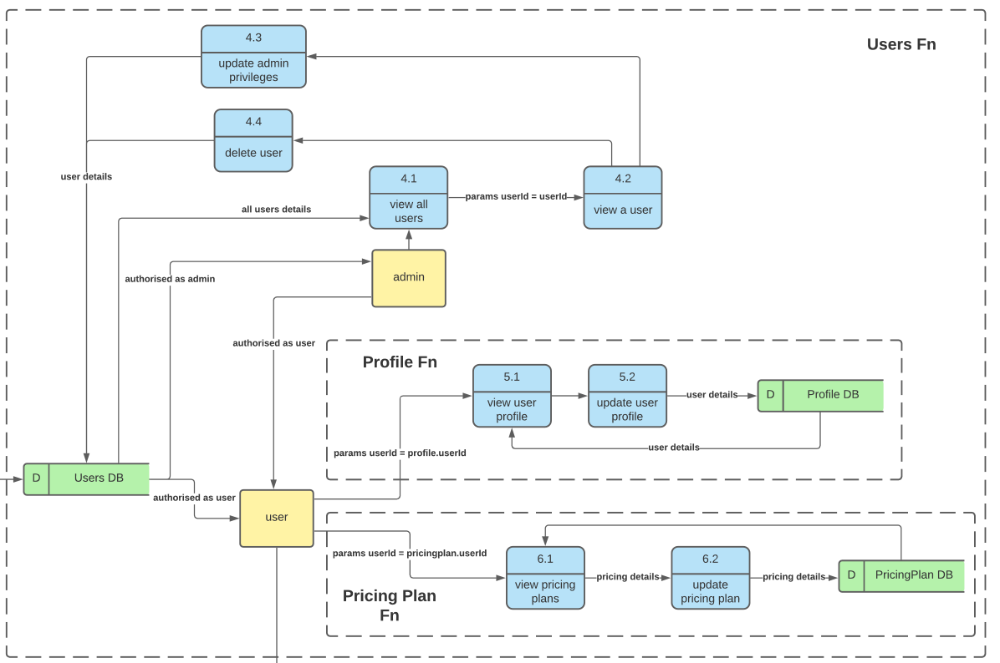

#### Profile Dataflow

`Users` will be able to view and update their profiles through the `Profile` database. Parameters such as `userId` will be passed to check and show the `User's` profile.

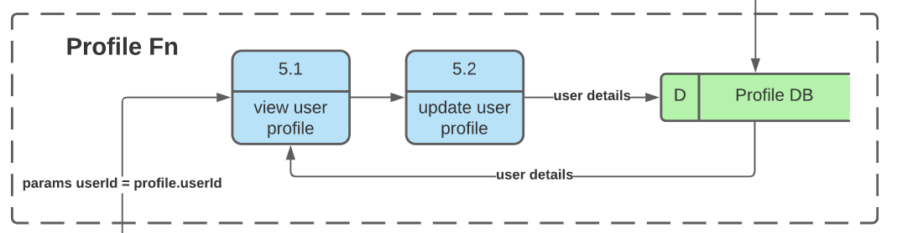

#### Pricing Plan Dataflow

Similar to the `Profile` dataflow, `Users` will be able to view and update their subscription plans through the `PricingPlan` database, where `Users` who have paid for the premium service will be shown. 

### Tasker Dataflow

As one of the core features of the application, two databases are required for the Tasker component to function, `Lists` and `Tasks` databases. The `userId` parameter is passed into the databases to collect their relevant information.

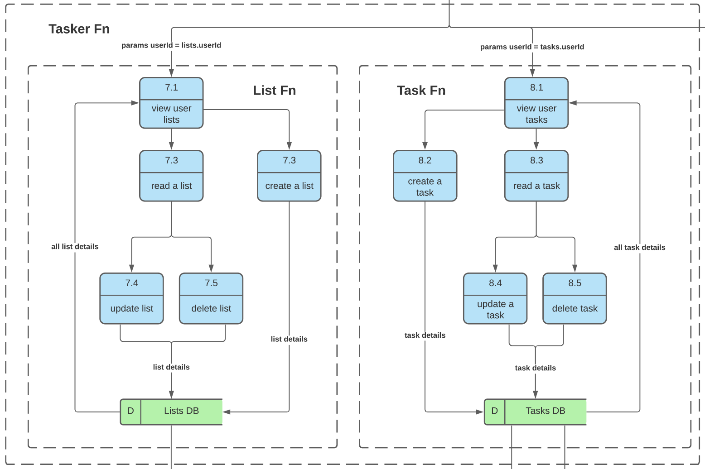

#### Lists Dataflow

Full CRUD functionality is available for the `User` to generate unique lists for tasks to be tagged into. 

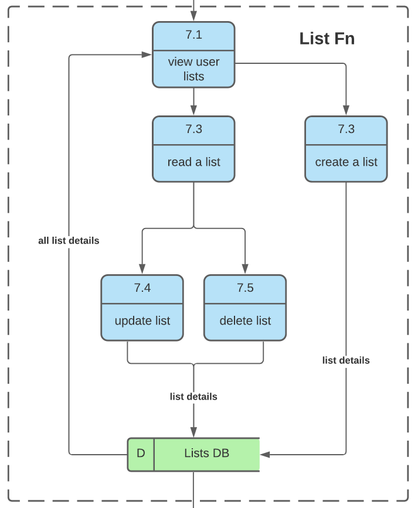

#### Tasks Dataflow

Similar to Lists, dataflow in the Tasks component will be managed through the `Tasks` database. All CRUD functionality will be passed through the `Tasks` database.

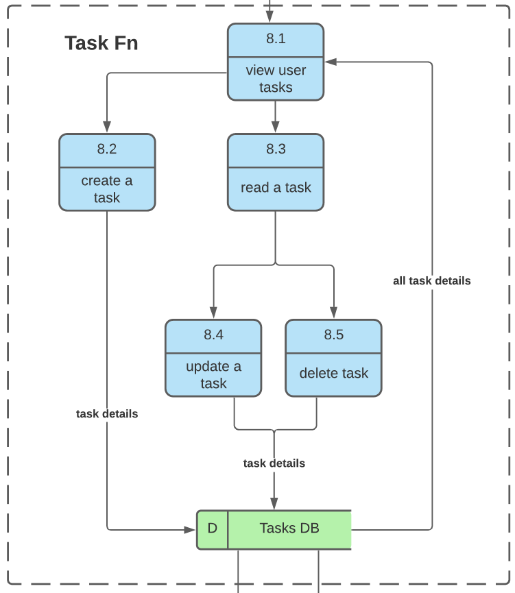

### Calendar Dataflow

Similar to Lists and Tasks, all calendar events set by the `Users` are shown and can be accessed through the `Calendar` database, where `userId` will be cross-referenced against the `userId` field in the database.

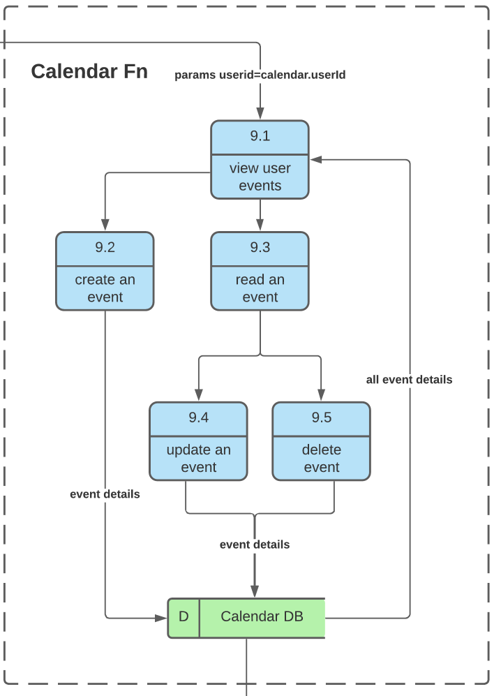

### Joining Tables Dataflow

Two major components to integrate Tasker and Calendar are joining tables as shown below. These will be set up within the Rails API such that:

- Lists will be a one-to-many relationship with Tasks, and;
- Calendars also have a one-to-many relationship with Tasks.

## Application Architecture Diagram -> thursday

## User Stories

- As a user, I want to be able to create an account/profile.

**Solution:**

Utilising the Devise gem, Untitled Suite will have an authentication structure for all users and admins. Users will only be able to access To-Do-lists that belong to their unique profile id.

- As a user, I want to be able to customise my profile avatar, colour scheme and details.

Untitled Suite will provide all users with the ability to change and edit their avatar, colour scheme and details. Through thr profile section located within the navbar, any user can access their profile dashboard and have access to such features.

**Solution:**

- As a user, I want to be able to create to-do lists/checklists.

Untitled Suite allows users once logged in to create up to 5 checklists at a time. Once a user has upgraded their account to premium level, they then have the ability to create unlimited checklists.

**Solution:**

- As a user, I want to be able to have my to-do lists and calender linked.

**Solution:**

Through Untitled Suite's smooth and user-friendly interface, any user can access the calender or their personal to-do lists from anywhere throughout the application. The user will also have to ability to link certain to-do lists to particular days, weeks or months within the calender. This allows the users to set time-frames and reminders within their profiles calender in accordance to particular items requiring attention.

- As a user, I want a user-friendly interface that can function on desktop, tablet and mobile devices with a simplistic design and responsive navigational layout.

**Solution:**

Utilising the extensive library offered by Material-UI, Untitled Suite will provide a very friend, smooth and rich experience in relation to its interface and overall design. The ability for all users to customise their profiles in accordance with their own styles and workflow allows Untitled Suite to provide users with the ultimate utilities experience mixed with each users personal touch.

- As a user, I want assurance of my accounts privacy and safety.

**Solution:**

Utilising Devise's extensive library of security features in addition to built in protocols allows users to create their own profiles, login and use the application within a friendly environment.

- As an admin, I to have access to the admin dashboard.

**Solution:**

Admin will be able to log into the application and have access to an onboard dashboard. This will act as a hub in which all admin, can access the application through a unique way. The Admin dashboard will only be accessible to users who have the status of admin. Other uses will not have access or vision of the dashboard within their experience of the application.

- As an admin, I to be able to view all users.

**Solution:**

Within the Admin dashboard, admin have access to all current users within the application's database. The dashboard will not only display all users but allow admin to perform various actions ( mentioned below).

- As an admin, I to be able to delete a user profile.

**Solution:**

One action available within the dashboard to all Admin is the ability to delete any user. The ability to delete an account will only be exercised if said user has broken, violated the terms and conditions of the application. The deletion of any user is a permanent action and can not be undone once performed.

- As a admin, I want to be able to assign users with admin status.

**Solution:**

The Admin dashboard allows the Admin to also promote users to Admin status. This feature allows for the growth of the admin staff as the growth of the application increases. This action is should be performed with caution and only be used once a user has gone through sufficient screening.

## Wireframes

The initial wireframes designed for Untitled Suite aim to maintain a basic structure and layout during the development and production cycles. After discussions with the stakeholders, some elements were modified and/or removed to cater for the MVP the clients sought out. Below is a breakdown of all wireframes and any changes that occurred during the design process. It should be noted that, in these initial designs, Untitled Suite maintained a mobile first design and will look to the future to continuously improve its design.

### Colour Scheme

Untitled Suite encourages creativity and enthusiasm throughout the project management process, despite the blank canvas the name suggests. To resemble this in the application, orange `#ff8e3c` is the primary colour used to convey this to the user and is a perfect colour to draw attention the main features of the application. For more details, [here](https://www.happyhues.co/palettes/9) is the combination of the colour scheme.

### Home Page

The home page is designed to give a brief introduction to the application and give Call-To-Actions (CTAs) for the user to sign up or login. The minimalism to the home page aims to help the user understand the simplicity of the application. 

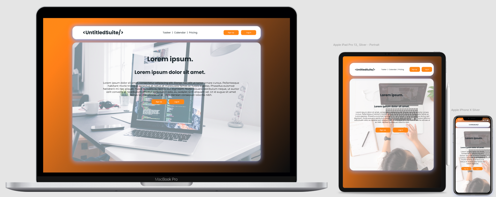

### Tasker Dashboard

Once logged in, the user is brought to Tasker as their default page. Here, the user will be able to view all their tasks, with the first being the tasks associated with today. It is a simple UI with the CTA buttons in orange and the Lists listed at the bottom of the page. Pagination was an initial idea discussed to achieve the list of the tasks, however was overruled with a scrolling capability to maintain the single page application (SPA) aspect. 

The layout of the application with the agenda to the side of the tasks was requested as it helped with the usability of the web app and helps manage the reminders of the tasks along with the meetings throughout the day. This component will be hidden on the smaller screen sizes to give more space to the core feature of the page.

Users can create new tasks and lists on this page by clicking the `Add New Task / List` button. An untitled task / list will be shown above the button where the user will be prompted to type in the title of the task / list.

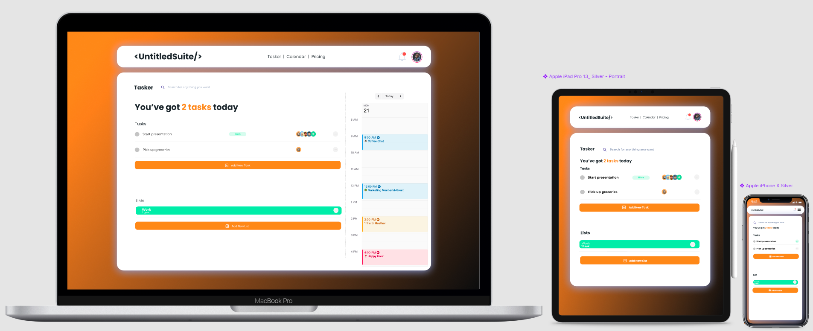

### Tasker - Edit / Delete Task Page

In the event of the user requiring to modify the task to be more specific, users can select the dot on the right side of the task and modify details of the task. Here, users are able to change the task details such as title, description, reminder date and many more. 

A calendar prompt will be shown once the `Reminder Date` is selected, and setting the date will set the reminder to notify the user of the task on the day. `Select List` will allow the user to associate the task with the list they have created prior to the task, which can be found at the bottom of the Tasker dashboard. `Select Priority` will allow the user to set the level of priority for the task.

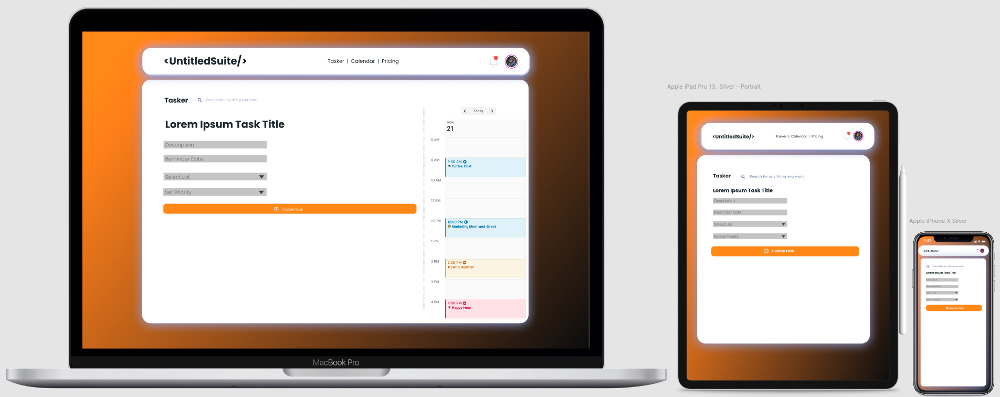

### Calendar Dashboard

Below is the default view of the Calendar dashboard, with Tasker on the left of the calendar and the weekly view as default for the user. Similar to the agenda feature in the Tasker dashboard, the Calendar dashboard hides the Tasker list in smaller screen sizes and gives more space and functionality to the Calendar. In these smaller screens, users will be able to create events with the `+` button on the bottom right of the screen. 

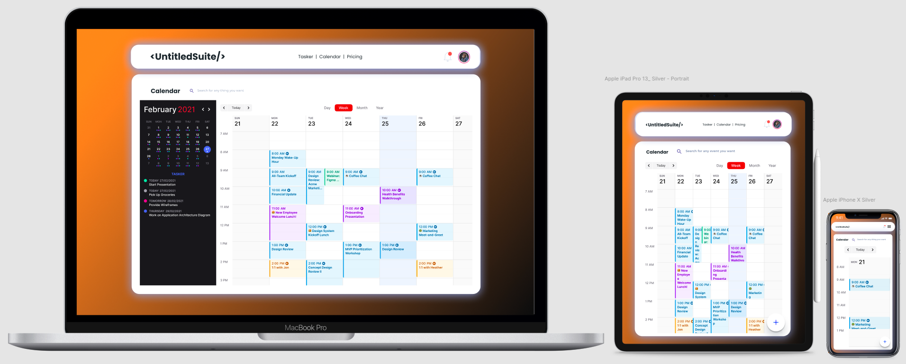

### Calendar - Add New Event / Edit Event Page 

Here, a modal component or pop up will show onto the screen when the user decides to add a new event or modify an existing event. Start and End dates are provided for the user to create the length of their meetings as well as description box for more in-depth details to the meeting.

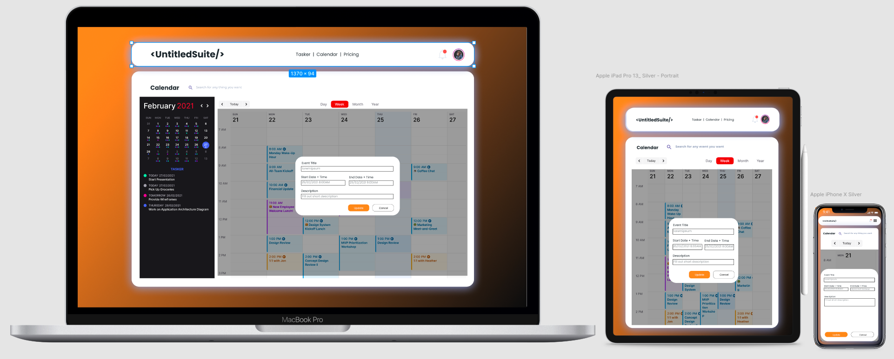

### Admin Page

For the administrators of the application, they will have special provisions to the application such as adding and removing users. `Update Selected` and `Delete Selected` are capabilities for the adminstrator to conduct actions in bulk or for various users.

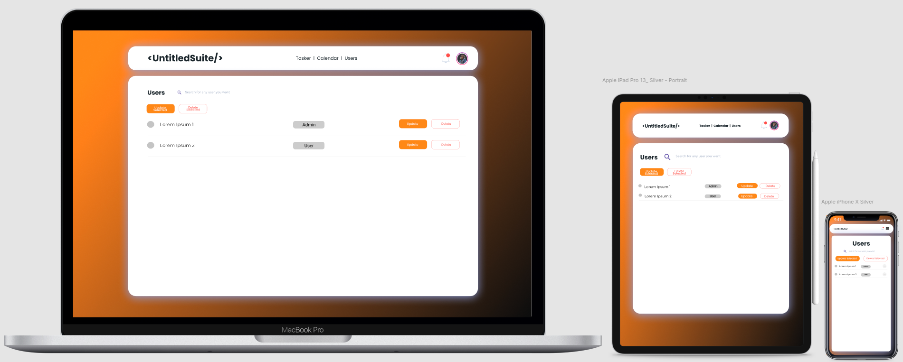

### Profile Page

Profile page will allow users to update their details on the application, such as their email and passwords. The username will be the source of truth and grant them access to Untitled Suite.

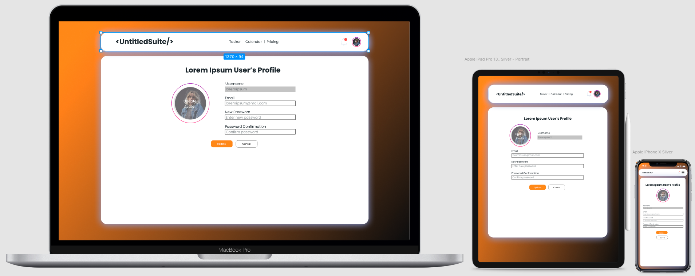

### Login Page

Here is a simple login page for the users to login into the application. 

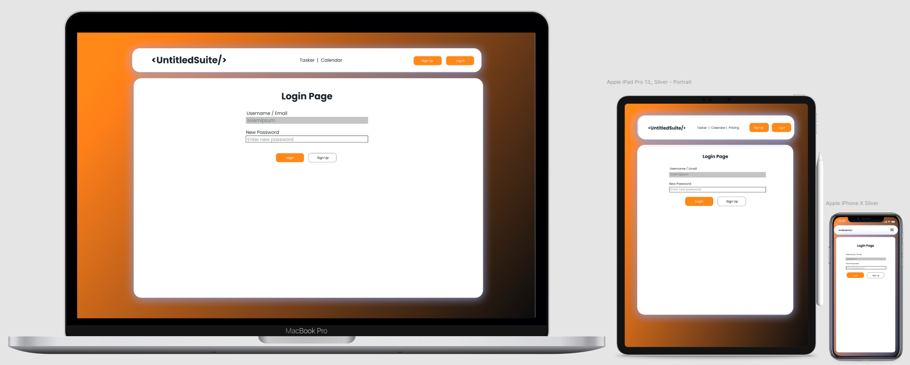

### Sign Up Page

Similar to the login page, here is a simple sign up page where the user will be able to enter in their desired username, email and password to login into the application.

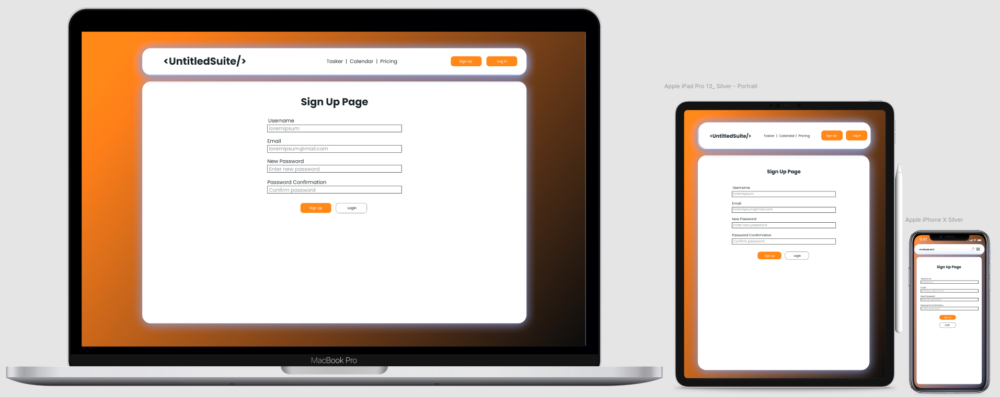

### Pricing Page 

Finally, here is the pricing page will be linked to a Paypal page where the user can pay for a subscription fee to upgrade their account and have access to the premium tier of the website.

In mobile view, the users will be able to scroll left to right to view the Premium option.

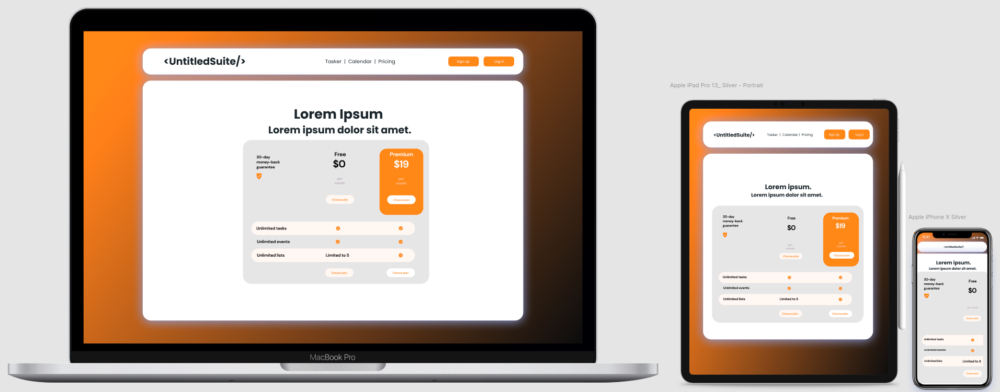

## Trello Board

For snapshots of the progress of our Trello board, check out the `docs/trello-board` folder. For access to the Trello board, here is the [Link to the Trello Board](https://trello.com/b/Bj5asYWU/untitled-suite) (shoot a message to Nathan or Ray for managing access). 

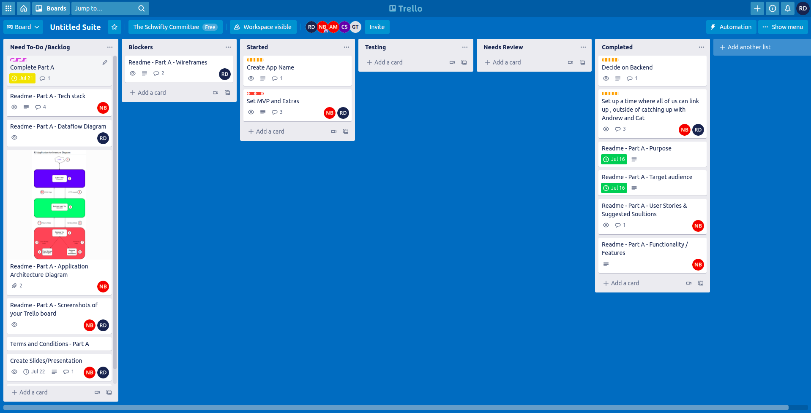

## Additional Features for Roadmap - Whats next?

Looking beyond Untitled Suite's initial release, the number one priority will be to enhance the user's experience by empowering their workspace alongside improving the overall functionality and security of the application.

### Admin Dashboard Updates

Through the intergration of an inbuilt messaging system and robust notification system, the admin dashboard will house the tools that will allow admin to handle the following tasks:

- Manage and resolve any user complaints
- Review and report any technical issues or bugs

### Single Sign-On (SSO) productive

The future of Untitled Suite will see users have the ability to create and log into their accounts using SSO, allowing for more connectivity between the application and their emails, google account and social medias. This will allow for a more fluent and productive experience on a professional and personal level.

### Profile Customisation

When a user logs into their account, they can access the profile customisation feature that allows them to perform the following actions:

- Update and change their profile avatar image
- Change the colour scheme and background design of their profile within Untitled Suite

### Friends List

Users are able to add other users and create a friends list. From the friends list, a user an then invite their friends to join them for events set within the calendar.

### Create Teams

Users can take friends from their friends list and create teams. Teams will be able to share lists within Tasker, allowing them to create, edit and delete tasks alongside constructing team events within the calender.

### Note-Taking Feature

Untitled Suite will add a new addition to its suite of tools in the form of a fully functionally notepad. This will allow users to create, edit and delete documentation on the fly. Additionally users can utilise a copy and paste functionality between tasker and the notepad for easier and more productive sessions. The notepad will also be linked to the calender allowing users to save and attach meeting minutes and ideas from the notepad with any given event.

## License

## References

- Santos, J 12 October 2021, Best Management Software & Tools, apps, project management software reviews, reviewed 15 July 2021, https://project-management.com/task-management-software
