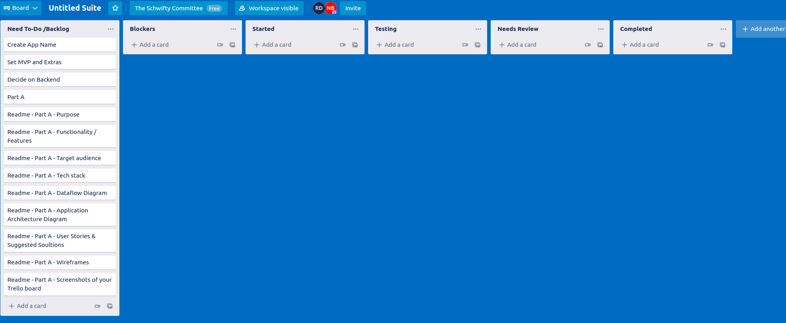

# untitled-suite

Built by:

- Nathan Blaga [GitHub](https://github.com/NJBLAGA)
- Gleb Tsoy [GitHub](https://github.com/Gleebo)
- Raymond Doan [GitHub](https://github.com/raymonddoan)

## Purpose

## Functionality / Features

## Target Audience

## Tech Stack

## Dataflow Diagram

## Application Architecture Diagram

## User Stories

- As a user, I want to be able to create an account/ profile.

**Solution:**

Utilising the Devise gem, Untitled Suite will have an authentication structure for all users and admins. Users will only be able to access To-Do-lists that belong to their unique profile id.

- As a user, I want to be able to customise my profile avatar, colour scheme and details.

Untitled Suite will provide all users with the ability to change and edit their avatar, colour scheme and details. Through thr profile section located within the navbar, any user can access their profile dashboard and have access to such features.

**Solution:**

- As a user, I want to be able to create to-do lists/checklists.

Untitled Suite allows users once logged in to create up to 5 checklists at a time. Once a user has upgraded their account to premium level, they then have the ability to create unlimited checklists.

**Solution:**

- As a user, I want to be able to have my to-do lists and calender linked.

**Solution:**

Through Untitled Suite's smooth and user-friendly interface, any user can access the calender or their personal to-do lists from anywhere throughout the application. The user will also have to ability to link certain to-do lists to particular days, weeks or months within the calender. This allows the users to set time-frames and reminders within their profiles calender in accordance to particular items requiring attention.

- As a user, I want a user-friendly interface that can function on desktop, tablet and mobile devices with a simplistic design and responsive navigational layout.

**Solution:**

Utilising the extensive library offered by Material-UI, Untitled Suite will provide a very friend, smooth and rich experience in relation to its interface and overall design. The ability for all users to customise their profiles in accordance with their own styles and workflow allows Untitled Suite to provide users with the ultimate utilities experience mixed with each users personal touch.

- As a user, I want assurance of my accounts privacy and safety.

**Solution:**

Utilising Devise's extensive library of security features in addition to built in protocols allows users to create their own profiles, login and use the application within a friendly environment.

- As an admin, I to have access to the admin dashboard.

**Solution:**

Admin will be able to log into the application and have access to an onboard dashboard. This will act as a hub in which all admin, can access the application through a unique way. The Admin dashboard will only be accessible to users who have the status of admin. Other uses will not have access or vision of the dashboard within their experience of the application.

- As an admin, I to be able to view all users.

**Solution:**

Within the Admin dashboard, admin have access to all current users within the application's database. The dashboard will not only display all users but allow admin to perform various actions ( mentioned below).

- As an admin, I to be able to delete a user profile.

**Solution:**

One action available within the dashboard to all Admin is the ability to delete any user. The ability to delete an account will only be exercised if said user has broken, violated the terms and conditions of the application. The deletion of any user is a permanent action and can not be undone once performed.

- As a admin, I want to be able to assign users with admin status.

**Solution:**

The Admin dashboard allows the Admin to also promote users to Admin status. This feature allows for the growth of the admin staff as the growth of the application increases. This action is should be performed with caution and only be used once a user has gone through sufficient screening.

## Wireframes

## Trello Board

[https://trello.com/b/Bj5asYWU/untitled-suite]

## License
